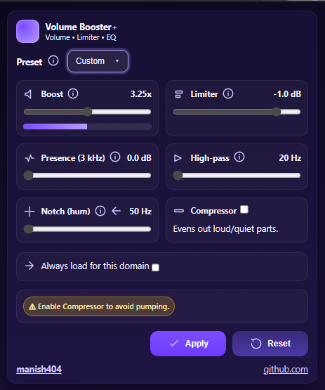

# Volume Booster+

**Chrome Extension | Boost • Limit • EQ | Vibe Coding🚀**

A sleek, AI-built volume enhancement extension for Chrome.
No bloat. No tracking. Just clean, per-tab audio control. Built for self use!



---

## ✨ Features

* **Boost** - Increase volume up to 3.25× with a smooth gain curve.
* **Limiter** - Prevent clipping by setting a ceiling (e.g., `-1.0 dB`).
* **Presence (3 kHz)** - Enhance vocal clarity without harshness.
* **High-pass filter** - Cut low-end rumble (down to 20 Hz).
* **Notch filter (hum)** - Remove unwanted mains hum (e.g., 50 Hz).
* **Compressor** - Even out loud/quiet parts (optional toggle).
* **Per-domain auto-load** - Remember your settings for specific sites.
* **Custom Presets** - Save and recall tailored EQ & boost settings.

---

## 🚀 Installation

### **Load unpacked extension** (Developer Mode)

1. Clone or download this repository.
2. Open Chrome and navigate to `chrome://extensions/`.
3. Enable **Developer mode** (top-right).
4. Click **Load unpacked** and select the `/extension` folder.
5. Pin the extension for quick access (via the puzzle icon).

---

## 🛠 How to Use

1. Play any audio/video in a tab.
2. Open **Volume Booster+** from the toolbar.
3. Adjust **Boost**, **Limiter**, and EQ sliders to taste.
4. Optionally enable the **Compressor** to smooth volume jumps.
5. Click **Apply** to save settings or **Reset** to defaults.

💡 *Tip:* Use **Always load for this domain** for sites like YouTube or Spotify so your profile is applied automatically.

---

## 🔐 Privacy

* No analytics, tracking, or telemetry.
* No remote code execution — all DSP runs locally via Web Audio API.
* Settings stored only in `chrome.storage.sync` for your account.

---

## 🧪 Verify Safety (No Bloat / No Malware)

1. **Check permissions** in `manifest.json` — should only include:

   * `"activeTab"`, `"storage"`, `"scripting"`.
2. **Search for remote scripts**:

   ```bash
   grep -R "http" .
   ```

   No third-party code loads from unknown domains.
3. **Audit size** — the built extension should be small (< few MB).
4. **Static scan** for dangerous functions:

   ```bash
   grep -R -E "eval\\(|new Function" .
   ```

---

## 📜 License

MIT © 2025 Manish — See [LICENSE](./LICENSE)

---

## 🔗 Links

* **GitHub:** [manish404](https://github.com/manish404)
* **Issues / Feedback:** Use the repo's issue tracker.

---
